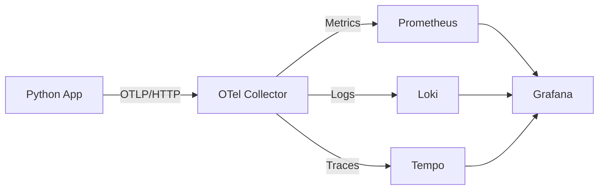
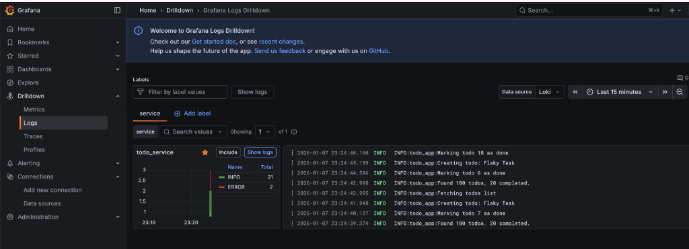
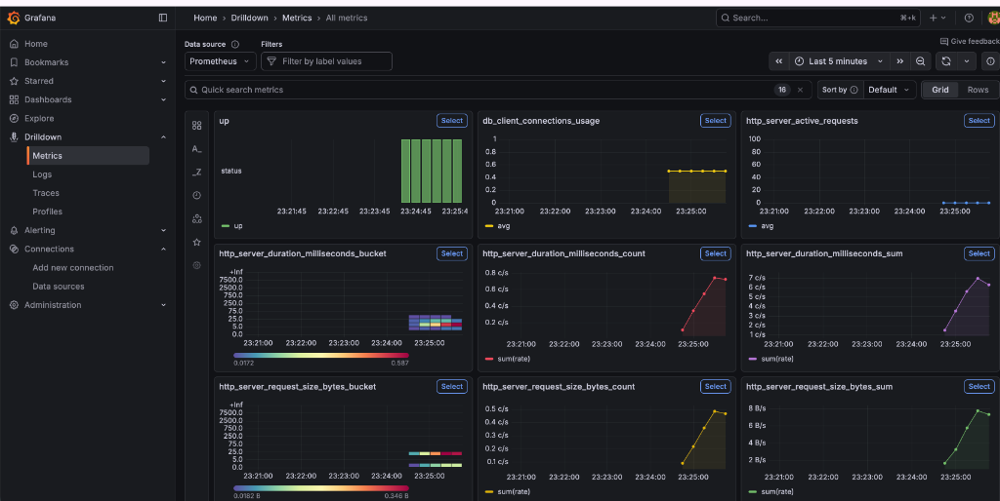
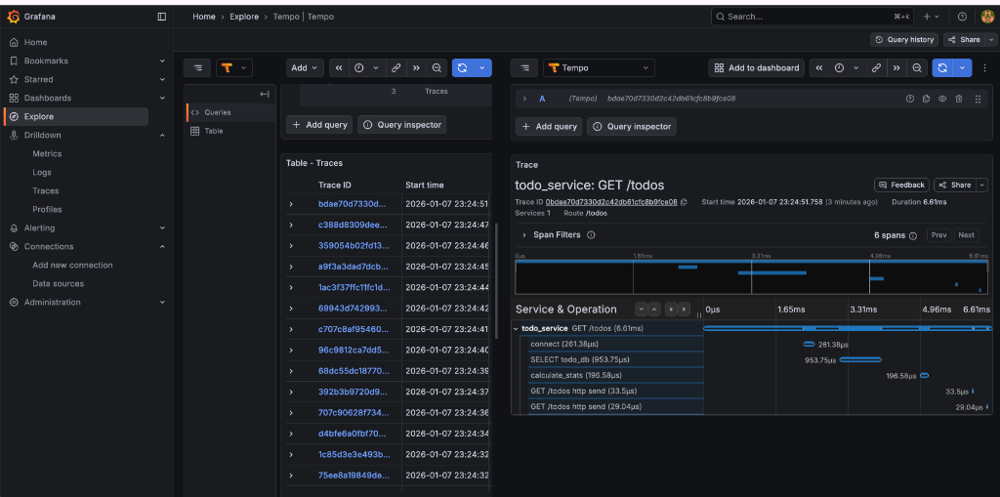
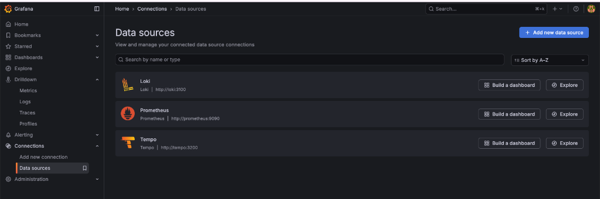

# Python Open Source Observability Stack: Logs & Metrics with OpenTelemetry

This project demonstrates a complete observability pipeline using Python, OpenTelemetry, Prometheus, Loki, and Grafana. It simulates a payment service generating logs and metrics, which are collected, processed, and visualized.

## 🏗 Architecture



### Components
*   **Python App**: Generates random transactions, logs (INFO, WARN, ERROR), and metrics (transaction counters). Uses `opentelemetry-python` SDK.
*   **OpenTelemetry Collector**: The central hub that receives data from the app, processes it, and exports it to backends.
*   **Prometheus**: Time-series database for storing metrics (numbers).
*   **Loki**: Log aggregation system for storing logs (text).
*   **Tempo**: Distributed tracing backend for storing traces (request flows).
*   **Grafana**: Visualization dashboard for metrics, logs, and traces.

## 🚀 Quick Start

1.  **Start the Stack**:
    ```bash
    cd monitoring
    docker compose up --build
    ```

2.  **Access Grafana**:
    *   Open [http://localhost:3000](http://localhost:3000)
    *   Login: `admin` / `admin`

3.  **View Data**:
    *   **Logs**: Go to **Explore** -> Select **Loki**. Query `{service_name="payment_service"}`.
        
    *   **Metrics**: Go to **Explore** -> Select **Prometheus**. Query `processed_transactions_total`.
        
    *   **Traces**: Go to **Explore** -> Select **Tempo**. Query by `TraceID` or use the visual search.
        

## 🛠 Troubleshooting & Implementation Journey

Building this stack involved overcoming several common integration hurdles. Here is a summary of the issues encountered and how they were resolved.

### 1. Connection Refused (Python App -> Collector)
**Issue**: The Python application crashed with `ConnectionRefusedError` or `Unavailable` when trying to send data to the OTel Collector.
**Root Cause**:
1.  **Protocol Mismatch**: Initial attempts used gRPC (port 4317), which can be flaky in some Docker networking setups due to proxies or HTTP/2 requirements.
2.  **Binding Address**: The OTel Collector default configuration often listens only on `localhost` loopback, meaning it accepts connections from *within* its own container but rejects connections from the Python App container.
**Solution**:
*   Switched the Python App (`app.py`) to use **HTTP Exporters** (port 4318) for both Logs and Metrics.
*   Explicitly configured the Collector (`otel-collector-config.yaml`) to listen on `0.0.0.0` for both HTTP and gRPC receivers.

### 2. "Resource to Telemetry Conversion" Config Error
**Issue**: The Collector failed to start with a configuration error: `'resource_to_telemetry_conversion' expected a map or struct, got "bool"`.
**root Cause**: The syntax for the Prometheus exporter configuration changed in recent versions of the OTel Collector.
**Solution**: Updated the config to the correct object syntax:
```yaml
resource_to_telemetry_conversion:
  enabled: true
```

### 3. Missing/Deprecated Loki Exporter
**Issue**: The Collector failed with `unknown type: "loki"`.
**Root Cause**: The specific `loki` exporter has been deprecated or removed from certain distributions of the OTel Collector Contrib image in favor of standard OTLP.
**Solution**: Configured the Collector to use the generic **OTLP HTTP Exporter** (`otlphttp`) pointing to Loki's OTLP ingestion endpoint (`http://loki:3100/otlp`).

### 4. Missing Grafana Datasources
**Issue**: Grafana required manual setup of Prometheus and Loki datasources every time the container restarted.
**Solution**: Added a **provisioning** file (`datasources.yaml`) and mounted it into the Grafana container. This automatically configures Prometheus and Loki as available data sources on startup.


## 📂 Key Files

*   `app.py`: The Python application logic + OpenTelemetry instrumentation.
*   `otel-collector-config.yaml`: Configuration for pipelines (Receivers -> Processors -> Exporters).
*   `docker-compose.yaml`: Orchestrates the 5-container stack.
